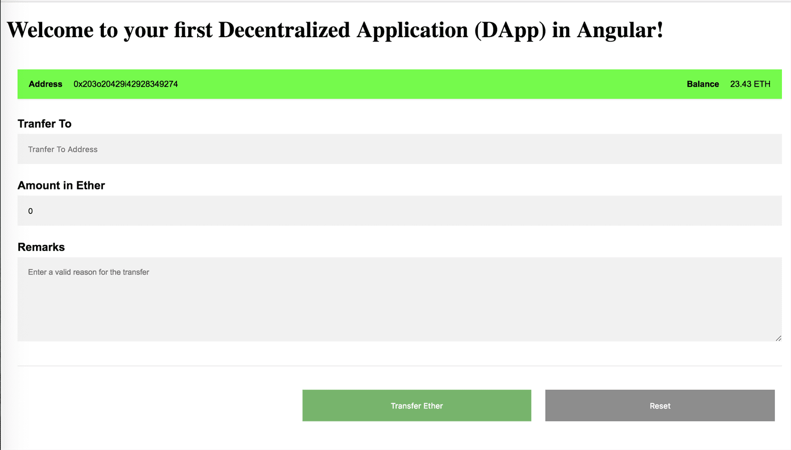

# angular-hardhat-dapp-starter

> Angular Hardhat Solidity DApp Starter

This template uses following versions:

```yaml
Angular: 13
Hardhat: 2.8
Ethers: 5.5
Solidity: 0.8.4
```



## Getting started

1. Clone this repo

2. Install dependencies

   ```bash
   $ npm install
   ```

3. Install Metamask (if you not already did) https://metamask.io/download/

4. Configure Polygon in Metamask https://docs.matic.today/docs/develop/metamask/config-polygon-on-metamask/ (switch to the Mumbai-Testnet Tab)

5. Rename `.env.dist` to `.env` and paste your Metamask private key into `PRIVATE_KEY`

6. Upload the contract to the Polygon Mumbai Testnet, make sure you have enough MATIC in Metamask (you can get test MATIC from here https://faucet.polygon.technology/)

   ```bash
   $ npm run deploy:testnet
   ```

7. Paste the contract address, you get on the command line, into `src/environments/environment.ts`

   ```typescript
   export const environment = {
     // ...
     contractAddress: "0x0011223344...",
     // ...
   };
   ```

8. Run angular application and test the app under http://localhost:4200

   ```bash
   $ ng serve
   ```

## This template has three pages

- The Homepage

  A list of all uploaded images.

- The authors page

  Only images are shown on this page that are uploaded by the selected account in Metamask.

- The upload form

  Here anybody who is connected via Metamask can upload an image with title and description. The image and the image metadata get uploaded to IPFS.

## Hardhat config

The default config `hardhat.config.js` is configured for the Polygon Network. Here you find examples for other Blockchains.

### Binance Smart Chain

```javascript
require("@nomiclabs/hardhat-waffle");
require("dotenv").config();

const privateKey = process.env.PRIVATE_KEY;

module.exports = {
  networks: {
    hardhat: {
      chainId: 1337,
    },
    testnet: {
      url: "https://data-seed-prebsc-1-s1.binance.org:8545",
      chainId: 97,
      gasPrice: 20000000000,
      accounts: [privateKey],
    },
    mainnet: {
      url: "https://bsc-dataseed.binance.org/",
      chainId: 56,
      gasPrice: 20000000000,
      accounts: [privateKey],
    },
  },
  solidity: "0.8.4",
};
```

&copy; 2022 - 2024 @codeguru827

All rights reserved.
